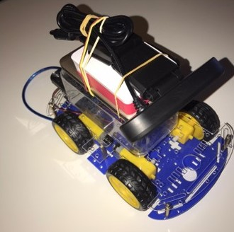
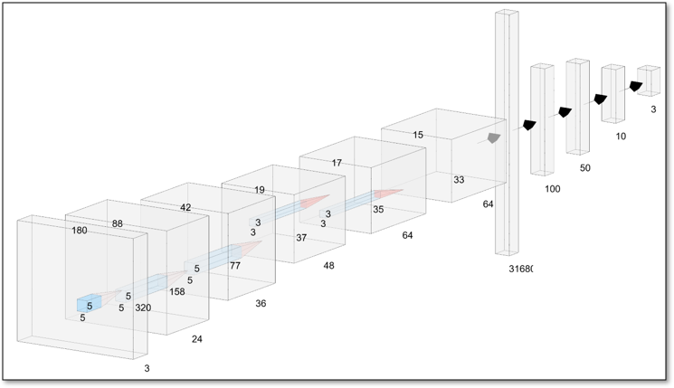

# Computer Vision and Machine Learning application in developing an autonomous car

**Video demo**

## Table of contents

- [Introduction](#introduction)
- [Hardware used](#hardware-used)
- [Neural Network architecture used](#neural-network-architecture-used)

## Introduction

The aim of this project is to create an end-to-end solution for a self driving small car.

## Hardware used

- 4-Wheel Drive robot kit
- Arduino Uno
- L293D Motor Shield
- Raspberry Pi 4 2GB
- FullHD USB Camera
- Battery Pack

## Neural Network architecture used

The architecture used for this project largely resembles DAVE-2 architecture developed by nVidia as can be seen in [this paper](https://developer.nvidia.com/blog/deep-learning-self-driving-cars/).

Since the input is different from the original paper, alterations were made to that layer to better accommodate the hardware on hand.
The live image is 3 channels deep with a resolution of 1280x720, which is then scaled down using OpenCV2's resize function to 320x180. This is done in order to reduce the size of the neural network which greatly speeds up the training and the inference.
Moving on, the architecture is the same, having the convolutional layers activated by ReLU functions and the Dense layers being liner. The output layer has 3 neurons representing the directions the car can take next (e.g. left, right, forward), being soft-max activated in order to get a probability distribution over predicted output classes.
